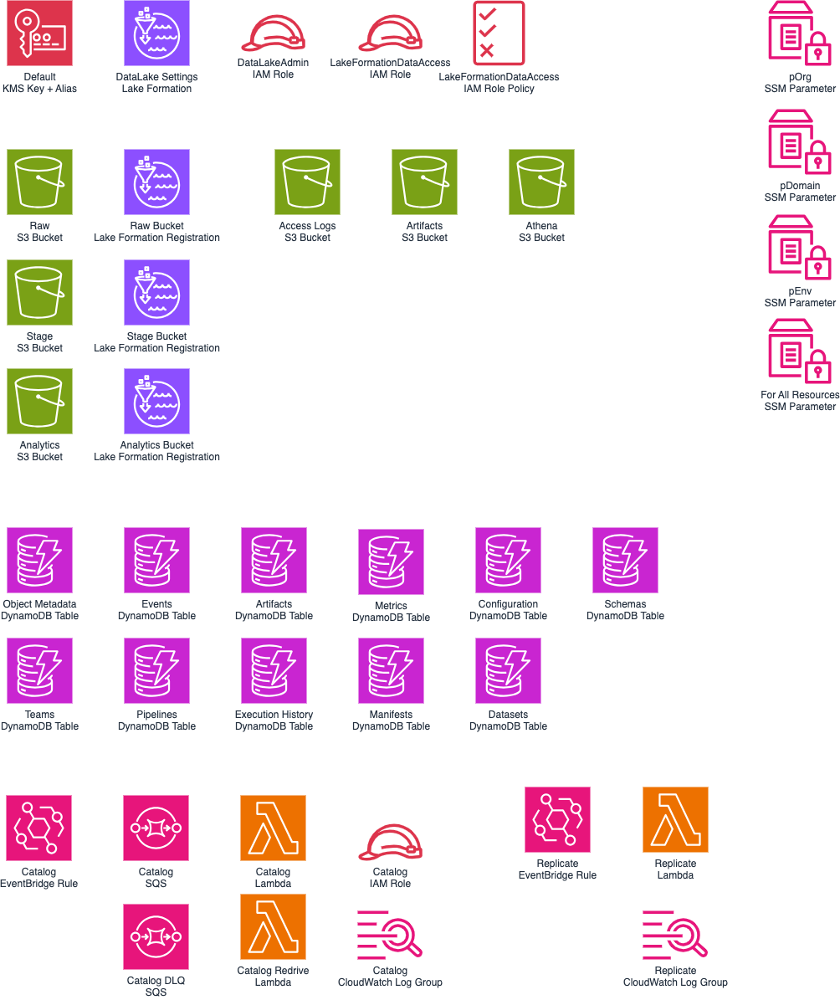

# sdlf-foundations

!!! note
    `sdlf-foundations` is defined in the [sdlf-foundations](https://github.com/awslabs/aws-serverless-data-lake-framework/tree/main/sdlf-foundations) folder of the [SDLF repository](https://github.com/awslabs/aws-serverless-data-lake-framework).

## Infrastructure

{: style="width:80%"}

`sdlf-foundations` contains, as the name implies, foundational resources of a data lake. Data in a data lake can be broadly categorized across [three distinct layers](https://docs.aws.amazon.com/whitepapers/latest/building-data-lakes/data-lake-foundation.html), with dedicated buckets:

- **Raw:** All data ingested from various data sources into the data lake lands in the raw bucket, in their original data format (*raw*). This can include structured, semi-structured, and unstructured data objects such as databases, backups, archives, JSON, CSV, XML, text files, or images.
- **Stage:** After raw data have been transformed or normalized through data pipelines, it is stored in a staging bucket (also called *transformed*). In this stage, data can be transformed into columnar data formats such as Apache Parquet and Apache ORC. These formats can be used by Amazon Athena.
- **Analytics:** Transformed data can be further enreched by blending other datasets to provide additional insights. This layer typically contains S3 objects which are optimized for analytics, reporting using Amazon Athena, Amazon Redshift Spectrum, and loading into massively-parallel processing data warehouses such as Amazon Redshift.

An important building block of a data lake on AWS is [AWS Lake Formation](https://aws.amazon.com/lake-formation/). It allows managing fine-grained data access permissions and share data. `sdlf-foundations` enables Lake Formation and register the previous buckets so that they can be managed through it.

!!! warning
    In an existing environment where IAM and resource policies are used extensively to manage permissions, or Lake Formation already has data lake administrators defined,
    `sdlf-foundations` can have unintended consequences. Please review the [official documentation](https://docs.aws.amazon.com/lake-formation/latest/dg/change-settings.html) on Lake Formation settings.

In addition to the above, `sdlf-foundations` creates three more buckets useful for data operations:

- **Artifacts** to store artifacts such as Glue job scripts and Lambda function source files.
- **Athena** to hold Athena query results.
- **Logs** for S3 access logs to the other buckets. It can also be used as a target for other types of logs produced by data pipelines if needed.

Everything is encrypted using SSE-KMS with [S3 Bucket Keys](https://docs.aws.amazon.com/AmazonS3/latest/userguide/bucket-key.html).

`sdlf-foundations` also puts in place a number of DynamoDB tables:

| Table                                            | Description                                                                               | SSM Parameter                   |
| ------------------------------------------------ | ----------------------------------------------------------------------------------------- | ------------------------------- |
| `octagon-ObjectMetadata-{environment}`           | Metadata for all objects in the data lake raw & stage buckets (populated by `sdlf-catalog`) | `/SDLF/Dynamo/ObjectCatalog`  |
| `octagon-Datasets-{environment}`                 | Metadata for all user-defined datasets (populated by `sdlf-dataset`)                      | `/SDLF/Dynamo/TransformMapping` |
| `octagon-Artifacts-{environment}`                | Metadata for all artifacts (currently empty, soon populated by `sdlf-cicd`)               |                                 |
| `octagon-Metrics-{environment}`                  | User-provided data pipeline metrics                                                       |                                 |
| `octagon-Configuration-{environment}`            | User-provided key-value configurations                                                    |                                 |
| `octagon-Teams-{environment}`                    | Metadata for all data teams and notification topics (populated by `sdlf-team`)            | `/SDLF/Dynamo/TeamMetadata`     |
| `octagon-Pipelines-{environment}`                | Metadata for all data pipeline stages (populated by `sdlf-team`)                          | `/SDLF/Dynamo/Pipelines`        |
| `octagon-Events-{environment}`                   | Logging (unused)                                                                          |                                 |
| `octagon-PipelineExecutionHistory-{environment}` | Track pipeline execution progress and history (populated by `sdlf-stageA`, `sdlf-stageB`) |                                 |
| `octagon-DataSchemas-{environment}`              | Structure of all datasets (populated by `sdlf-replicate`, based on Glue catalog)          | `/SDLF/Dynamo/DataSchemas`      |
| `octagon-Manifests-{environment}`                | Track manifests and files for manifest-file-based processing                              | `/SDLF/Dynamo/Manifests`        |

The `sdlf-catalog` Lambda function is used to populate `octagon-ObjectMetadata` automatically whenever a new object is uploaded or deleted from the `raw` and `stage` buckets. The `sdlf-replicate` Lambda function copies the schema of any new Glue database or Glue database whose schema is updated.

SSM parameters holding names or ARNs are created for all resources that may be used by other modules.

!!! warning
    The data lake admin team should be the only one with write access to the `sdlf-foundations` code base, as it can impact an entire data lake environment including data pipelines within it.

## Usage

### CloudFormation with [sdlf-cicd](cicd.md)

Read the official [SDLF workshop](https://sdlf.workshop.aws/) for an end-to-end deployment example.

```
rExample:
    Type: awslabs::sdlf::foundations::MODULE
    Properties:
        pPipelineReference: !Ref pPipelineReference
        pChildAccountId: 111111111111
        pOrg: forecourt
        pDomain: proserve
        pEnvironment: dev
```

## Interface

Interfacing with other modules is done through [SSM Parameters](https://docs.aws.amazon.com/systems-manager/latest/userguide/systems-manager-parameter-store.html). `sdlf-foundations` publishes the following parameters:

| SSM Parameter                              | Description                                                      | Comment                                      |
| ------------------------------------------ | ---------------------------------------------------------------- | -------------------------------------------- |
| `/SDLF/Dynamo/ObjectCatalog`               | Name of the DynamoDB used to store metadata                      |                                              |
| `/SDLF/Dynamo/TransformMapping`            | Name of the DynamoDB used to store mappings to transformation    |                                              |
| `/SDLF/Dynamo/Pipelines`                   | Name of the DynamoDB used to store pipelines metadata            |                                              |
| `/SDLF/Dynamo/TeamMetadata`                | Name of the DynamoDB used to store teams metadata                |                                              |
| `/SDLF/Dynamo/DataSchemas`                 | Name of the DynamoDB used to store data schemas                  |                                              |
| `/SDLF/Dynamo/Manifests`                   | Name of the DynamoDB used to store manifest process metadata     |                                              |
| `/SDLF/IAM/LakeFormationDataAccessRole`    | Lake Formation Data Access Role name                             |                                              |
| `/SDLF/IAM/LakeFormationDataAccessRoleArn` | Lake Formation Data Access Role ARN                              |                                              |
| `/SDLF/IAM/DataLakeAdminRoleArn`           | Lake Formation Data Lake Admin Role ARN                          |                                              |
| `/SDLF/KMS/KeyArn`                         | ARN of the default KMS key used for encrypting data lake buckets |                                              |
| `/SDLF/Misc/pOrg`                          | Name of the Organization owning the datalake                     |                                              |
| `/SDLF/Misc/pDomain`                       | Data domain name                                                 |                                              |
| `/SDLF/Misc/pEnv`                          | Environment name                                                 |                                              |
| `/SDLF/S3/AccessLogsBucket`                | Access Logs S3 bucket name                                       |                                              |
| `/SDLF/S3/ArtifactsBucket`                 | Artifacts S3 bucket name                                         |                                              |
| *`/SDLF/S3/CentralBucket`*                 | *Central S3 bucket name*                                         | deprecated, use `/SDLF/S3/RawBucket` instead |
| `/SDLF/S3/RawBucket`                       | Raw S3 bucket name                                               |                                              |
| `/SDLF/S3/StageBucket`                     | Stage S3 bucket name                                             |                                              |
| `/SDLF/S3/AnalyticsBucket`                 | Analytics S3 bucket name                                         |                                              |
| `/SDLF/S3/AthenaBucket`                    | Athena query results S3 bucket name                              |                                              |
