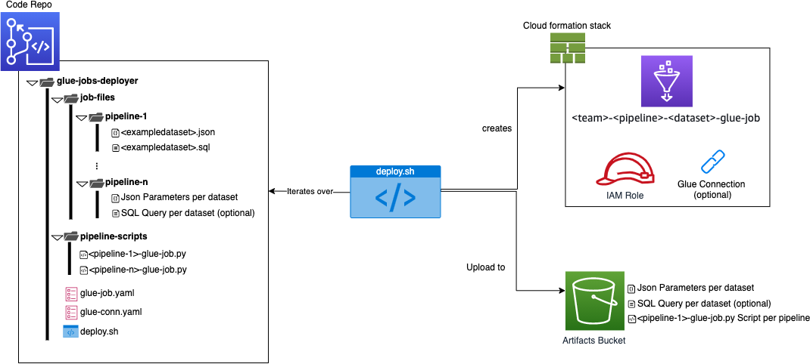

# Motivation

To deploy glue jobs as the process step in a stage in the SDLF is one of the most common tasks you have to accomplish once the framework is deployed and transformations based on glue jobs are added to be used as part of a pipeline. 

# Solution

This artifact is a solution, implemented as a folder structure, including a deploy.sh main script, to be able to automatically deploy several glue jobs, based on the concepts of pipeline and dataset from the SDLF.

The artifact pretends easily create as much glue jobs as necessary trough a single shared Yaml CloudFormation template, for different “types” of processes organized in folders to be named as the related pipelines/datasets deployed in the framework.

Using this structure, you will have a unique script (Python/Scala) per pipeline, and several Json parameter files as descriptors to manage the specific behavior of the script per dataset.

The proposed **deploy.sh** script can be included as part of a code pipeline, to automatically create/update the new or changed dataset parameters files, since the las commit in the repo, so not all glu jobs are are created each time you deploy. 

 


# Requirements

* SDLF deployed in the target account
* CLI access to the target account
* Permissions to read SSM parameters created during SDLF deployment
* Permissions to use the KMS keys of the SDLF
* Permissions to write files in the s3 artifacts bucket of the SDLF
* Permissions to create glue connections, glue jobs, iam roles

# How to use
1. Configure credentials for your SDLF environment account (DEV/TEST/PROD) as explained in this blog entry: https://docs.aws.amazon.com/cli/latest/userguide/cli-configure-profiles.html
1. Locate your Pyspark/Glue Script in the pipeline-script folder
1. Locate your Json dataset parameters file (to be used in your pyspark script) in the job-files folder
1. Run the deployment script using the following syntax
    *  Using all default parameters: 
        ```
        ./deploy.sh
        ```
    * Giving parameters
         ```
        ./deploy.sh -p default -s CFNBucket -a ArtifactsBucket -e dev -t engineering -c Y 
        ```   
        Where:

        | **Parameter**   |            |**default value**|
        |----------|-------------|------|
        | -p |  Name of the AWS profile to use | default 
        | -s |  Name of S3 bucket to upload CFN artifacts to | value for the ssm parameter /SDLF/S3/CFNBucket |
        | -a |  Name of S3 bucket to upload SDLF artifacts to | value for the ssm parameter /SDLF/S3/ArtifactsBucket |
        | -e |  Name of the SDLF enviromnment |  dev |
        | -t |  Name of the owner team of the Glue jobs | engineering |
        | -c |  Y or N to create or not a glue connection, if yes, a parameters-conn-$ENV.json file should exist | Y |

        This command will create one glue job and the corresponding role for each .json parameters file in the **job-files** folder, using the given pipeline script in the **pipeline-scrips** folder for each pipeline.

# Output
    
The proposed script will upload the necessary scripts and parameter files to the SDLF artifacts bucket, and deploy one glue job per dataset trough a CloudFormation common stack template, to be defined from parameters like the dataset name and the pipeline name.


# Going to the pieces ...
There are 4 main pieces in the proposed folder structure:

1. **glue-job.yaml**: this CloudFormation template includes a standard definition for glue jobs creation including the corresponding role. Notice that 4 parameters are expected (given from deploy.sh);
    - pJobFiles: is a list of s3 paths with specific dataset parameter files including additional configuration required for the main pipeline glue job script.
    - pPipelineName and pDatasetName: the names of the related pipeline and dataset, to be used in the glue job name itself.
    - pAllocatedCapacity: a number indicating the glue job allocated capacity. 

1. **pipeline_scrips** folder: This folder will contain one script per pipeline in the SDLF having a glue job step in any stage. 

    The first part of the script name should be the same name of the pipeline; <<PIPELINE_NAME>>-glue-job.py 
    
    The script will contain all the personalized Spark logic for that specific pipeline.

1. **job_files** folder: This folder will contain one sub-folder per pipeline named as the pipeline.  In the presented example there are 3 pipelines deployed in the framework, that uses Glue jobs as process in one of their steps; jdbc2stage, analytics, and jdbcing.
    
    For each pipeline folder, at least a Json parameters file should exits, and each Json parameter file should be named as the related dataset in the SDLF.
    
1. **deploy.sh**: this is the main script of the proposed solution.
    
    The script will iterate over the job_files folder and create a glue job for each .json file there.
